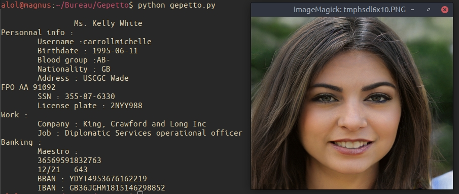

# Gepetto : v1.0
Generate new identities using thispersondoesnotexist.com and a face recognition api

## how to use

Simple ! First clone this repository with `git clone https://github.com/yarienkiva/Gepetto.git` then install the needed libraries
`pip3 install -r requirements.txt` (please use python3).
After that create an account on a face recognition platform and get your api key, I've added two python scripts, one for [face++](https://www.faceplusplus.com/face-detection/) and one for [microsoft azure](https://azure.microsoft.com/services/cognitive-services/face/)but feel free to use your own solution (just be sure to return a gender and an age).
Now just run 
`python gepetto.py`
and generate new identities.

## how does it work ?

I'll soon write a blog post [here](https://yarienkiva.ml/whatever_this_article_is_called) to document the thought process and steps I've taken to code this project.

## soon...
This is a work in progress and (much) more while be added in the future :
* argparse to manage the parameters
* an option to save the output to a file/qr code
* an option to give a user-chosen image
